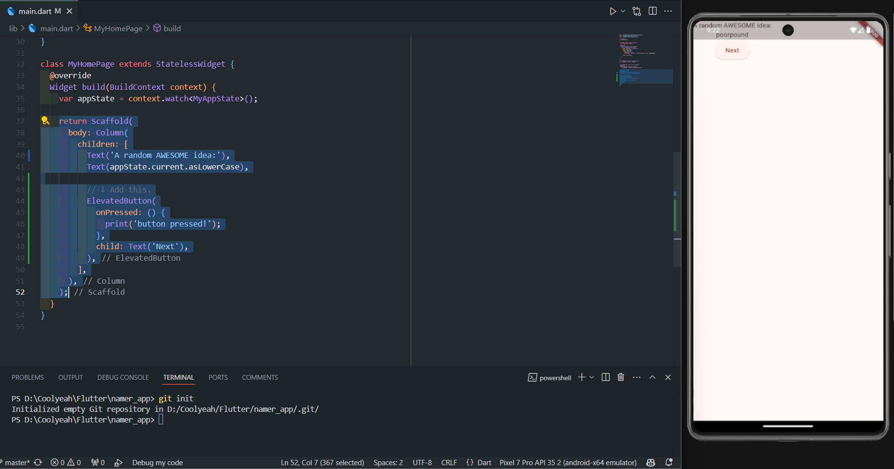

# namer_app

A new Flutter project.

---
### Laporan Praktikum 

**Nama : Daffa Yudisa A**

**Kelas : TI-3A / 06**

**NIM : 22241720008**

---

1. Membuat projek dengan menekan tombol Ctrl + Shift + P maka akan tampil Command Palette dan ketik flutter untuk merincikan dan pilih "Flutter: New Project". Setelah melakukan langkah pembuatan projek baru di flutter, maka anda akan diarahkan menuju file explorer untuk memilih lokasi penyimpanan dimana projek flutter tersebut akan disimpan. Setelah memilih direktori penyimpanan projek, maka pengguna akan diberi textfield untuk memberikan nama projek flutter ini. Pada praktikum ini nama projek yang digunakan adalah "namer_app".

    
<br></br>

2. lalu buka file pubspec.yaml dan ganti konten file seperti gambar di bawah

    
<br></br>

3. Berikutnya, buka file konfigurasi lainnya dalam proyek tersebut, analysis_options.yaml. Ganti konten file seperti gambar di bawah

    
<br></br>

4. Buka file main.dart pada folder lib, lalu isi seperti kode program berikut

    
<br></br>

5. Coba run dan akan tampil kata random seperti gambar berikut:

    
<br></br>

6. Pada bagian ini dibuat button next yang nantinya akan berfungsi sebagai tombol yang merubah kata yang ada.
    ```dart
    return Scaffold(
        body: Column(
            children: [
            Text('A random AWESOME idea:'),
            Text(appState.current.asLowerCase),

            // ↓ Add this.
            ElevatedButton(
                onPressed: () {
                print('button pressed!');
                },
                child: Text('Next'),
            ),

            ],
        ),
        );
    ```

    
<br></br>

7. Scroll ke MyAppState lalu tambahkan metode getNext.
    ```dart
    class MyAppState extends ChangeNotifier {
        var current = WordPair.random();

        // ↓ Add this.
        void getNext() {
            current = WordPair.random();
            notifyListeners();
        }
    }
    ```

    Metode getNext() baru menetapkan ulang current dengan WordPair acak baru. Metode ini juga memanggil notifyListeners()(metode ChangeNotifier) yang memastikan bahwa semua orang yang melihat MyAppState diberi tahu.

    Tindakan terakhir adalah memanggil metode getNext dari callback tombol tersebut.
    ```dart
    ElevatedButton(
        onPressed: () {
            appState.getNext();  // ← This instead of print().
        },
        child: Text('Next'),
    ),
    ```
    
<br></br>

8. Sekarang baris tersebut mengakses appState, tetapi sebenarnya baris tersebut hanya perlu mengetahui apa pasangan kata saat ini. Oleh karena itu, tulis ulang widget MyHomePage sebagai berikut:
    ```dart
    class MyHomePage extends StatelessWidget {
    @override
    Widget build(BuildContext context) {
        var appState = context.watch<MyAppState>();
        var pair = appState.current;                 // ← Add this.

        return Scaffold(
        body: Column(
            children: [
            Text('A random AWESOME idea:'),
            Text(pair.asLowerCase),                // ← Change to this.
            ElevatedButton(
                onPressed: () {
                appState.getNext();
                },
                child: Text('Next'),
            ),
            ],
        ),
        );
    }
    }
    ```
    Pada menu Refactor (Ctrl+.), pilih Extract Widget. Tetapkan nama, seperti BigCard, lalu klik Enter.

    Tindakan ini secara otomatis membuat class baru, BigCard, di akhir file saat ini. Class tersebut akan terlihat seperti berikut:
    ```dart
    class BigCard extends StatelessWidget {
        const BigCard({
            super.key,
            required this.pair,
        });

        final WordPair pair;

        @override
        Widget build(BuildContext context) {
            return Text(pair.asLowerCase);
        }
    }
    ```

    Temukan class BigCard dan metode build() yang berada di dalamnya. Sama seperti sebelumnya, panggil menu Refactor pada widget Text. Namun, kali ini Anda tidak akan mengekstrak widget.

    Sebagai gantinya, pilih Wrap with Padding. Tindakan ini menciptakan widget induk baru di sekitar widget Text bernama Padding. Setelah menyimpannya, Anda akan melihat bahwa kata acak tersebut telah memiliki ruang yang lebih luas.

    Berikutnya, mari kita naik satu tingkat lebih tinggi. Tempatkan kursor Anda pada widget Padding, buka menu Refactor, lalu pilih Wrap with widget.

    Tindakan ini memungkinkan Anda untuk menentukan widget induk. Ketik "Card" dan tekan Enter. Setelah melakukan serangkaian langkah tersebut maka akan menghasilkan output sebagai berikut

    
<br></br>

9. Untuk membuat kartu menjadi lebih menarik, beri warna yang lebih kaya pada kartu tersebut. Karena ada baiknya untuk menjaga skema warna yang konsisten, gunakan Theme aplikasi untuk memilih warna.
    ```dart
    @override
    Widget build(BuildContext context) {
        final theme = Theme.of(context);       // ← Add this.

        return Card(
        color: theme.colorScheme.primary,    // ← And also this.
        child: Padding(
            padding: const EdgeInsets.all(20),
            child: Text(pair.asLowerCase),
        ),
        );
    }
    ```
    Kini, kartu telah diwarnai dengan warna primer aplikasi:

    
<br></br>

10. Kartu tersebut masih memiliki masalah: ukuran teks terlalu kecil dan warnanya membuat teks sulit dibaca. Untuk memperbaiki masalah ini, buat perubahan berikut pada metode build() BigCard.
    ```dart
    @override
    Widget build(BuildContext context) {
        final theme = Theme.of(context);
        // ↓ Add this.
        final style = theme.textTheme.displayMedium!.copyWith(
        color: theme.colorScheme.onPrimary,
        );

        return Card(
        color: theme.colorScheme.primary,
        child: Padding(
            padding: const EdgeInsets.all(20),
            // ↓ Change this line.
            child: Text(pair.asLowerCase, style: style),
        ),
        );
    }
    ```

    
<br></br>

11. Dapat dilihat bahwa tampilan yang dihasilkan masih berposisi di pojok kiri atas, hal ini tentunya mengganggu kenyamanan user dalam membaca isi informasi yang ada. Perlu doingat bahwa BigCard adalah bagian dari Column. Secara default, kolom menggabungkan turunan kolom di bagian atas, tetapi kita dapat mengganti ini dengan mudah. Buka metode build() MyHomePage, dan buat perubahan berikut:
    ```dart
    class MyHomePage extends StatelessWidget {
        @override
        Widget build(BuildContext context) {
            var appState = context.watch<MyAppState>();
            var pair = appState.current;

            return Scaffold(
            body: Column(
                mainAxisAlignment: MainAxisAlignment.center,  // ← Add this.
                children: [
                Text('A random AWESOME idea:'),
                BigCard(pair: pair),
                ElevatedButton(
                    onPressed: () {
                    appState.getNext();
                    },
                    child: Text('Next'),
                ),
                ],
            ),
            );
        }
        }
    ```

    
<br></br>

    Dapat dilihat bahwa posisi dari elemen sudah berada di tengah sebelah kiri, belum benar-benar di tengah dari layar yang ada, untuk itu bisa dilakukan dengan melakukan refactor pada bagian body: Column lalu pilih Wrap with Center. Seperti gambar di bawah:

    
<br></br>

    Karena dirasa teks A random AWESOME idea: mengganggu bisa dihapus sehingga tampilan bisa lebih nyaman.

    ```dart
    class MyHomePage extends StatelessWidget {
        @override
        Widget build(BuildContext context) {
            var appState = context.watch<MyAppState>();
            var pair = appState.current;

            return Scaffold(
            body: Center(
                child: Column(
                mainAxisAlignment: MainAxisAlignment.center,
                children: [
                    BigCard(pair: pair),
                    SizedBox(height: 10),
                    ElevatedButton(
                    onPressed: () {
                        appState.getNext();
                    },
                    child: Text('Next'),
                    ),
                ],
                ),
            ),
            );
        }
        }
    ```
    
<br></br>

12. Scroll ke MyAppState dan tambahkan kode untuk logika bisnis berikut:
    ```dart
    class MyAppState extends ChangeNotifier {
        var current = WordPair.random();

        void getNext() {
            current = WordPair.random();
            notifyListeners();
        }

        // ↓ Add the code below.
        var favorites = <WordPair>[];

        void toggleFavorite() {
            if (favorites.contains(current)) {
            favorites.remove(current);
            } else {
            favorites.add(current);
            }
            notifyListeners();
        }
        }
    ```

    Periksa perubahannya:

    * Menambahkan properti baru pada MyAppState yang bernama favorites. Properti ini diinisialisasi dengan daftar kosong: [].
    * Menentukan bahwa daftar tersebut hanya dapat berisi pasangan kata: <WordPair>[], menggunakan generik. Hal ini membantu membuat aplikasi Anda menjadi lebih lengkap—Dart bahkan menolak menjalankan aplikasi jika Anda mencoba menambahkan apa pun selain WordPair. Oleh karena itu, Anda dapat menggunakan daftar favorites karena tidak boleh ada objek yang tidak diinginkan (seperti null) yang bersembunyi di dalamnya.
    * Menambahkan metode baru, toggleFavorite(), yang menghapus pasangan kata saat ini dari daftar favorit (jika sudah ada), atau menambahkannya (jika belum ada). Dalam kedua kasus tersebut, kode memanggil notifyListeners(); setelahnya.

        
    br></br>

13. Berikut satu cara untuk menambahkan tombol kedua untuk MyHomePage. Kali ini, gunakan konstruktor ElevatedButton.icon() untuk membuat tombol dengan ikon. Di bagian atas metode build, pilih ikon yang sesuai tergantung pada apakah pasangan kata saat ini sudah berada di favorit atau tidak. Selain itu, perhatikan penggunaan SizedBox lagi, untuk menjaga jarak antara kedua tombol.

    ```dart
    class MyHomePage extends StatelessWidget {
        @override
        Widget build(BuildContext context) {
            var appState = context.watch<MyAppState>();
            var pair = appState.current;

            // ↓ Add this.
            IconData icon;
            if (appState.favorites.contains(pair)) {
            icon = Icons.favorite;
            } else {
            icon = Icons.favorite_border;
            }

            return Scaffold(
            body: Center(
                child: Column(
                mainAxisAlignment: MainAxisAlignment.center,
                children: [
                    BigCard(pair: pair),
                    SizedBox(height: 10),
                    Row(
                    mainAxisSize: MainAxisSize.min,
                    children: [

                        // ↓ And this.
                        ElevatedButton.icon(
                        onPressed: () {
                            appState.toggleFavorite();
                        },
                        icon: Icon(icon),
                        label: Text('Like'),
                        ),
                        SizedBox(width: 10),

                        ElevatedButton(
                        onPressed: () {
                            appState.getNext();
                        },
                        child: Text('Next'),
                        ),
                    ],
                    ),
                ],
                ),
            ),
            );
        }
        }
    ```

    
<br></br>

14. Disini kita akan membuat sidebar yang terdiri dari dua fitur yakni homepage dan favorites page. Dimana home page adalah tempat untuk mencari kata yang sesuai dan favorites page adalah tempat memilih kata-kata yang telah disukai.

    ```dart
    class MyHomePage extends StatelessWidget {
        @override
        Widget build(BuildContext context) {
            return Scaffold(
            body: Row(
                children: [
                SafeArea(
                    child: NavigationRail(
                    extended: false,
                    destinations: [
                        NavigationRailDestination(
                        icon: Icon(Icons.home),
                        label: Text('Home'),
                        ),
                        NavigationRailDestination(
                        icon: Icon(Icons.favorite),
                        label: Text('Favorites'),
                        ),
                    ],
                    selectedIndex: 0,
                    onDestinationSelected: (value) {
                        print('selected: $value');
                    },
                    ),
                ),
                Expanded(
                    child: Container(
                    color: Theme.of(context).colorScheme.primaryContainer,
                    child: GeneratorPage(),
                    ),
                ),
                ],
            ),
            );
        }
        }

        class GeneratorPage extends StatelessWidget {
            @override
            Widget build(BuildContext context) {
                var appState = context.watch<MyAppState>();
                var pair = appState.current;

                IconData icon;
                if (appState.favorites.contains(pair)) {
                icon = Icons.favorite;
                } else {
                icon = Icons.favorite_border;
                }

                return Center(
                child: Column(
                    mainAxisAlignment: MainAxisAlignment.center,
                    children: [
                    BigCard(pair: pair),
                    SizedBox(height: 10),
                    Row(
                        mainAxisSize: MainAxisSize.min,
                        children: [
                        ElevatedButton.icon(
                            onPressed: () {
                            appState.toggleFavorite();
                            },
                            icon: Icon(icon),
                            label: Text('Like'),
                        ),
                        SizedBox(width: 10),
                        ElevatedButton(
                            onPressed: () {
                            appState.getNext();
                            },
                            child: Text('Next'),
                        ),
                        ],
                    ),
                    ],
                ),
                );
            }
        }
    ```

    
<br></br>

15. Ubah class MyHomePage yang awalnya berupa stateless menjadi stateful widget dengan menggunakan refactor(ctrl + .) kemudian, pilih Convert to StatefulWidget. Widget stateful baru hanya perlu melacak satu variabel: selectedIndex. Buat 3 perubahan berikut untuk _MyHomePageState:

    ```dart
    class _MyHomePageState extends State<MyHomePage> {

        var selectedIndex = 0;     // ← Add this property.

        @override
        Widget build(BuildContext context) {
            return Scaffold(
            body: Row(
                children: [
                SafeArea(
                    child: NavigationRail(
                    extended: false,
                    destinations: [
                        NavigationRailDestination(
                        icon: Icon(Icons.home),
                        label: Text('Home'),
                        ),
                        NavigationRailDestination(
                        icon: Icon(Icons.favorite),
                        label: Text('Favorites'),
                        ),
                    ],
                    selectedIndex: selectedIndex,    // ← Change to this.
                    onDestinationSelected: (value) {

                        // ↓ Replace print with this.
                        setState(() {
                        selectedIndex = value;
                        });

                    },
                    ),
                ),
                Expanded(
                    child: Container(
                    color: Theme.of(context).colorScheme.primaryContainer,
                    child: GeneratorPage(),
                    ),
                ),
                ],
            ),
            );
        }
        }
    ```

16. Kolom samping navigasi kini merespons interaksi pengguna. Namun, area yang diperluas di sebelah kanan tetap sama. Hal itu karena kode tidak menggunakan selectedIndex untuk menentukan apa yang ditampilkan di layar. Tempatkan kode berikut di bagian atas metode build _MyHomePageState, tepat sebelum return Scaffold
    ```dart
    class _MyHomePageState extends State<MyHomePage> {
        var selectedIndex = 0;

        @override
        Widget build(BuildContext context) {
            Widget page;
            switch (selectedIndex) {
            case 0:
                page = GeneratorPage();
                break;
            case 1:
                page = Placeholder();
                break;
            default:
                throw UnimplementedError('no widget for $selectedIndex');
            }

            return Scaffold(
            body: Row(
                children: [
                SafeArea(
                    child: NavigationRail(
                    extended: false,
                    destinations: [
                        NavigationRailDestination(
                        icon: Icon(Icons.home),
                        label: Text('Home'),
                        ),
                        NavigationRailDestination(
                        icon: Icon(Icons.favorite),
                        label: Text('Favorites'),
                        ),
                    ],
                    selectedIndex: selectedIndex,
                    onDestinationSelected: (value) {
                        setState(() {
                        selectedIndex = value;
                        });
                    },
                    ),
                ),
                Expanded(
                    child: Container(
                    color: Theme.of(context).colorScheme.primaryContainer,
                    child: page,  // ← Here.
                    ),
                ),
                ],
            ),
            );
        }
        }
    ```
    
<br></br>

17. Berikutnya, buat kolom samping navigasi menjadi responsif. Dengan kata lain, buat agar kolom samping navigasi menampilkan label secara otomatis (menggunakan extended: true) saat ada ruang yang cukup. Berikut kode programnya:
    ```dart
    class _MyHomePageState extends State<MyHomePage> {
        var selectedIndex = 0;

        @override
        Widget build(BuildContext context) {
            Widget page;
            switch (selectedIndex) {
            case 0:
                page = GeneratorPage();
                break;
            case 1:
                page = Placeholder();
                break;
            default:
                throw UnimplementedError('no widget for $selectedIndex');
            }

            return LayoutBuilder(builder: (context, constraints) {
            return Scaffold(
                body: Row(
                children: [
                    SafeArea(
                    child: NavigationRail(
                        extended: constraints.maxWidth >= 600,  // ← Here.
                        destinations: [
                        NavigationRailDestination(
                            icon: Icon(Icons.home),
                            label: Text('Home'),
                        ),
                        NavigationRailDestination(
                            icon: Icon(Icons.favorite),
                            label: Text('Favorites'),
                        ),
                        ],
                        selectedIndex: selectedIndex,
                        onDestinationSelected: (value) {
                        setState(() {
                            selectedIndex = value;
                        });
                        },
                    ),
                    ),
                    Expanded(
                    child: Container(
                        color: Theme.of(context).colorScheme.primaryContainer,
                        child: page,
                    ),
                    ),
                ],
                ),
            );
            });
        }
        }
    ```
    
<br></br>

18. Karena favorites page awalnya hanya berupa halaman kosong, tambahkan kode program berikut sehingga favorites page bisa menyimpan kata-kata yang disuka.
    ```dart
    class FavoritesPage extends StatelessWidget {
        @override
        Widget build(BuildContext context) {
            var appState = context.watch<MyAppState>();

            if (appState.favorites.isEmpty) {
            return Center(
                child: Text('No favorites yet.'),
            );
            }

            return ListView(
            children: [
                Padding(
                padding: const EdgeInsets.all(20),
                child: Text('You have '
                    '${appState.favorites.length} favorites:'),
                ),
                for (var pair in appState.favorites)
                ListTile(
                    leading: Icon(Icons.favorite),
                    title: Text(pair.asLowerCase),
                ),
            ],
            );
        }
        }
    ```

    Inilah fungsi widget tersebut:

    * Widget ini mendapatkan status aplikasi saat ini.
    * Jika daftar favorit kosong, pesan terpusat berikut akan ditampilkan: No favorites yet*.*
    * Jika tidak, daftar (dapat di-scroll) akan ditampilkan.
    * Daftar tersebut dimulai dengan ringkasan (misalnya, You have 5 favorites*.*).
    * Kode tersebut kemudian melakukan iterasi di seluruh favorit dan membuat widget ListTile untuk masing-masing favorit.

    Yang tersisa sekarang adalah mengganti widget Placeholder dengan FavoritesPage. Hasilnya adalah sebagai berikut:

    
<br></br>
